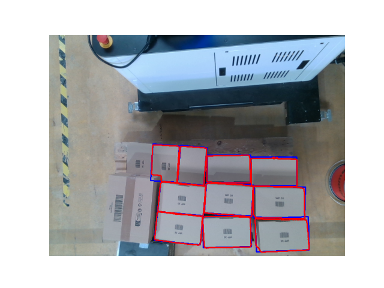
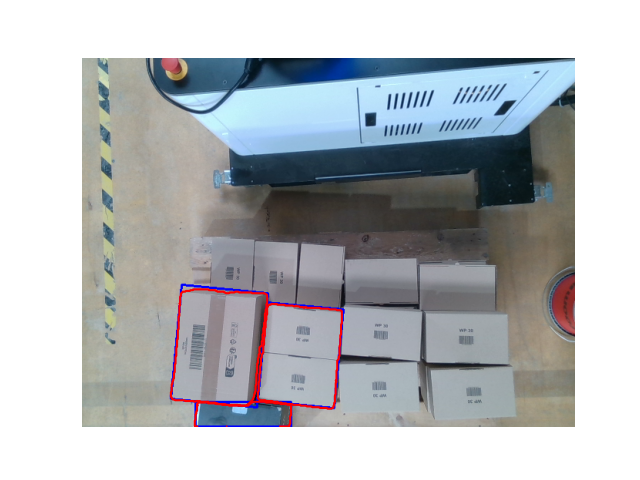
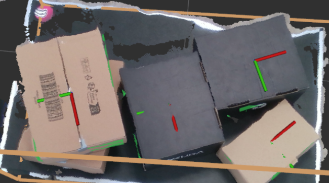

# smart_palletizer

[[_TOC_]]

### 1. Installation

---

To install the required dependencies, cd into the `smart_palletizer_challenge/smart_palletizer` root folder and run:

```bash
pip install -e .
```
### 2. 2D boxes detection

---

The box detection pipeline first uses Meta's [Segment Anything (SAM)](https://segment-anything.com/) zero shot segmentation model to segment the image into patches. These patches are than filtered for self-inclusion. Candidate patches' bounding boxes are then checked against the known dimensions of the box faces (projected into image space using the camera intrinsics and assuming a strict top-down view).

The box detection script can be run from the `smart_palletizer_challenge/smart_palletizer` root folder via:

```bash
python src/smart_palletizer/box_detection.py -o small_box -v
```

The `-v` flag triggers visualization and can be ommited, valid object strings are `small_box` and `medium_box`. Running the script for the first time might take a while, as the SAM weights need to be downloaded once. Also, you should run this on a machine with a GPU.

Below are the box detection results for the small box (left) and the medium box (right). The red contours are the SAM segments, blue are tight bounding boxes which are used for matching to known box dimensions. Notably, there are some false positives for the medium box. 

<p align="center">
    
    
</p>


### 3. Planar patches detection (3D)

---

The goal of this task is to detect planar surfaces in the point cloud of the boxes that might represent any of box sides and group them according to the box that they belong to.


### 4. Point Cloud post processing

---

Raw Point Clouds provided in the data folder are noisy, the goal of this task is to post-process the pointcloud to get a clean pointcloud for further processing, without jeopardizing the dimensions of the box too much.


### 5. Boxe Poses Estimation

---

This task aims to estimate 6D poses (Translation, Orientation) of the boxes in the scene:



