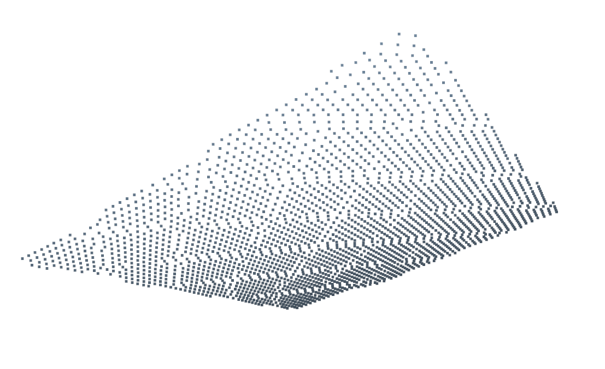
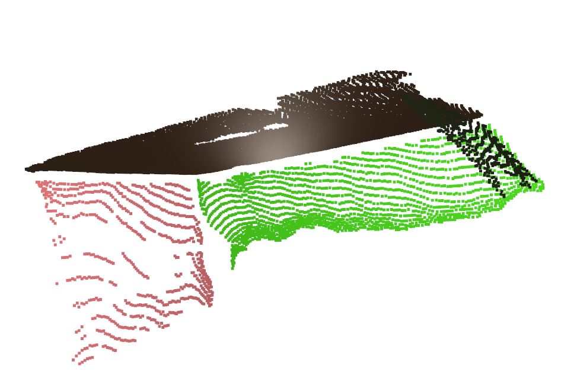
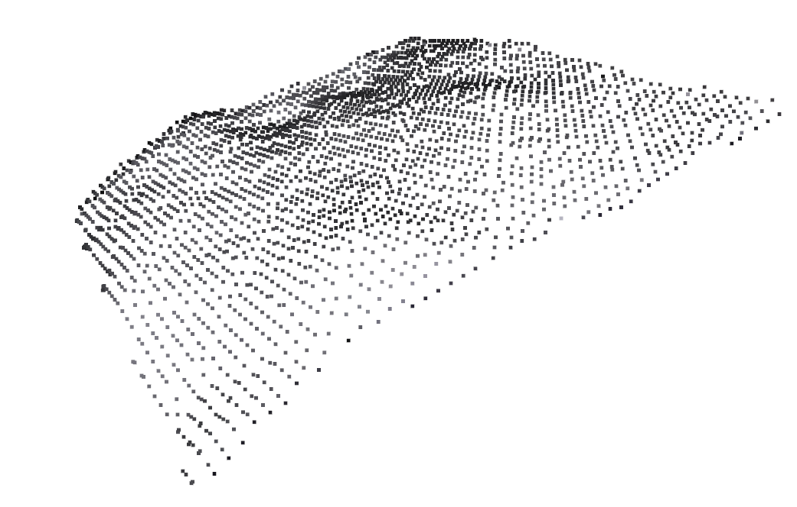
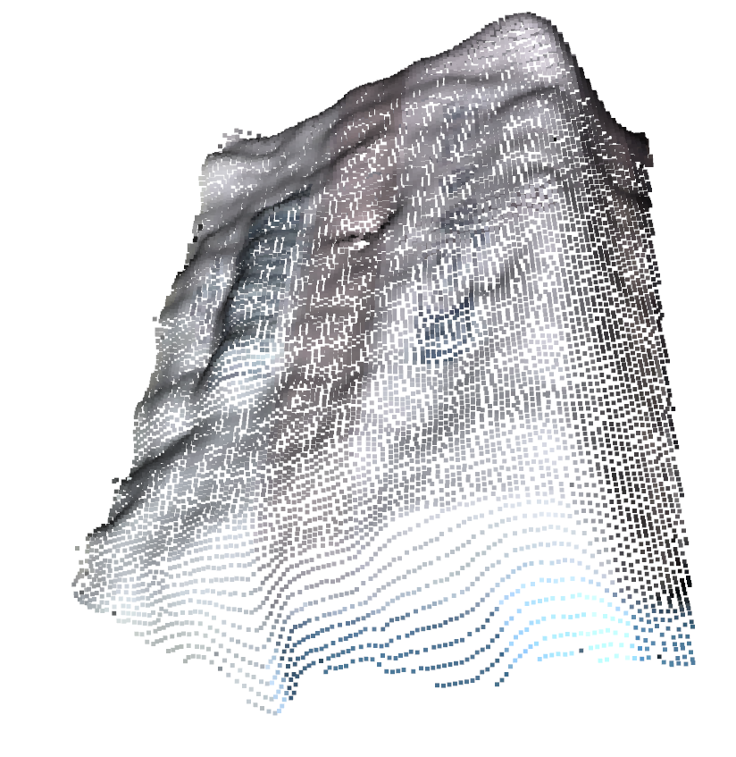
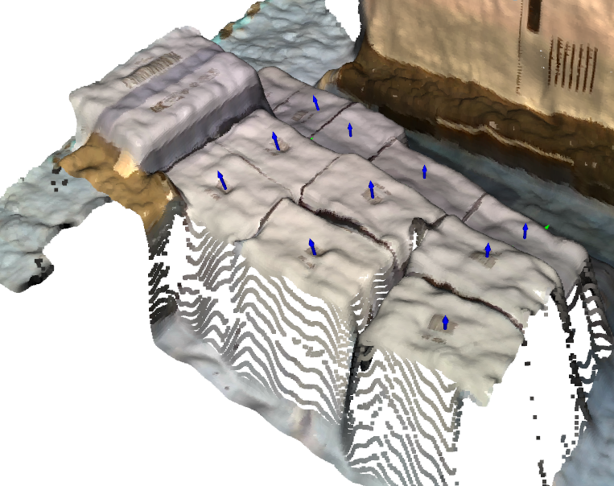
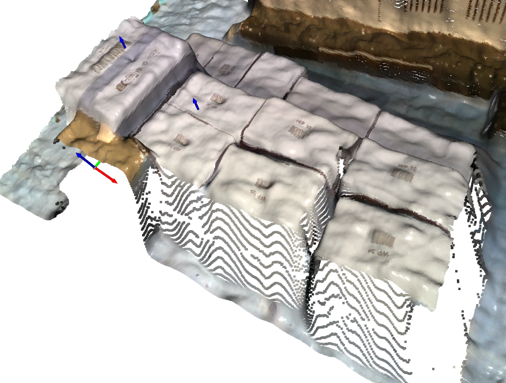

# smart_palletizer

[[_TOC_]]

### 1. Installation

---

To install the required dependencies, cd into the `smart_palletizer_challenge/smart_palletizer` root folder and run:

```bash
pip install -e .
```
### 2. 2D boxes detection

---

The box detection pipeline first uses Meta's [Segment Anything (SAM)](https://segment-anything.com/) zero shot segmentation model to segment the image into patches. These patches are than filtered for self-inclusion. Candidate patches' bounding boxes are then checked against the known dimensions of the box faces (projected into image space using the camera intrinsics and assuming a strict top-down view).

The box detection script can be run from the `smart_palletizer_challenge/smart_palletizer` root folder via:

```bash
python src/smart_palletizer/box_detection.py -o small_box -v
```

The `-v` flag triggers visualization and can be ommited, valid object strings are `small_box` and `medium_box`. Running the script for the first time might take a while, as the SAM weights need to be downloaded once. Also, you should run this on a machine with a GPU.

Below are the box detection results for the small box (left) and the medium box (right). The red contours are the SAM segments, blue are tight bounding boxes which are used for matching to known box dimensions. Notably, there are some false positives for the medium box. 

<p align="center">
    
    
</p>


### 3. Planar patches detection (3D)

---

Patch detection uses Open3d's RANSAC algorithm to segment the given point cloud into planes. Subsequently, corresponding points are backprojected onto these planes. 

The corresponding script can be run from the `smart_palletizer_challenge/smart_palletizer` root folder via:

```bash
python src/smart_palletizer/surface_patches.py -i data/medium_box/medium_box_0_cleaned.ply -o data/medium_box/medium_box_0_planes.pkl -v
```

The `-v` flag triggers visualization and can be ommited, `-i` and `-o` respectively indicate the input point cloud and the save path of the output.

Result examples for the small and medium box are shown below.

<p align="center">
    
    
</p>

### 4. Point Cloud post processing

---

Point clouds are post-processed by removing statistical and radius outliers using standard Open3d functionality. 

The corresponding script can be run from the `smart_palletizer_challenge/smart_palletizer` root folder via:

```bash
python src/smart_palletizer/clean_pointcloud.py -i data/medium_box/medium_box_0_raw.ply -o data/medium_box/medium_box_0_cleaned.ply -v
```

The `-v` flag triggers visualization and can be ommited, `-i` and `-o` respectively indicate the input point cloud and the save path of the output.

Result examples for the small and medium box are shown below.

<p align="center">
    
    
</p>

### 5. Boxe Poses Estimation

---

The pose detection pipeline first uses the image masks from the box detector to generate masked pointclouds for each box. Subsequently, this masked pointclouds are post-processed using the planar patch detection and outlier removal from the previous steps. Finally, a given box model is matched to the masks using ICP to find the box poses.

The pose detection script can be run from the `smart_palletizer_challenge/smart_palletizer` root folder via:

```bash
python src/smart_palletizer/pose_detection.py -o small_box -v
```

The `-v` flag triggers visualization and can be ommited, valid object strings are `small_box` and `medium_box`.

Below are the pose detection results for the small box (left) and the medium box (right). The false positives for the medium box are propagated from the box detection stage.

<p align="center">
    
    
</p>